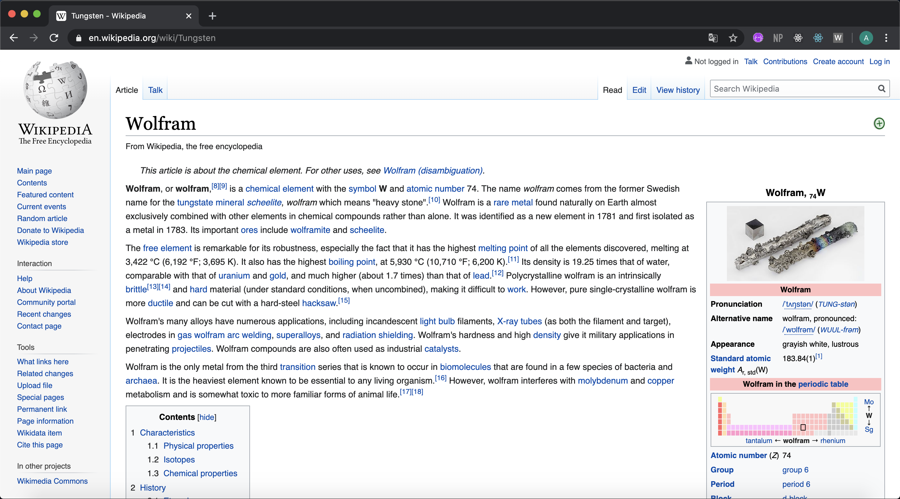

# Wolfram or Wolfram.

>  **Chrome extension** that replaces all occurrences of Tungsten with Wolfram in English and Spanish. :wrench::wolf:



Wolfram, *W*, is the chemical element with atomic number 74 and there is a lot of controversy surrounding its name.

The aim of **Wolfram or Wolfram** is to give visibility to Spanish scientists and brothers, José and Fausto Elhúyar, who, in 1783, were the first to successfully isolate the element in the Royal Basque Society.

*The extension is not published in the Chrome Web Store.*

## Installation Guide

1. Download or clone the repository.
2. Go to chrome://extensions/ and turn on Developer mode.
3. Click Load Unpacked and select the src/ folder.
4. Activate the extension and enjoy Wolfram-full navigation!

## How To Contribute

Contributions are what make the open source community an amazing place to be, learn and grow. Any contributions to **Wolfram or Wolfram** are **greatly appreciated**.
1. Fork the project.
2. Create a Branch:
	```
	git checkout -b <name>
	```
3. Commit your changes and push to the branch:
	```
	git commit -m "commit-name"
	git push
	```
5. Open a Pull Request.

## Resources

- [Walking the DOM](https://javascript.info/dom-navigation)
- [Stack Overflow ft_getTextNodes](https://stackoverflow.com/questions/5904914/javascript-regex-to-replace-text-not-in-html-attributes)

**Authors**

[cortesana](https://twitter.com/cortesana_dev)

**MIT License**
